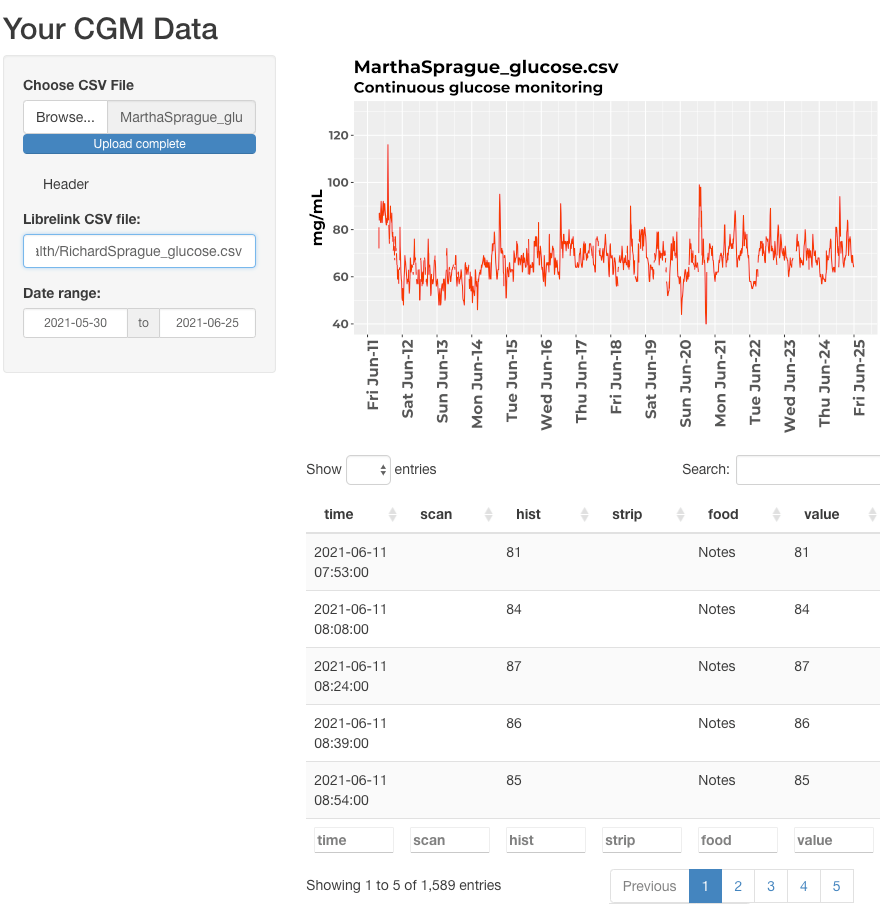

# Personal Science Shiny CGM

This is an R Shiny app that will plot the CGM results from a Freestyle Libre Libreview CSV file.

Enter the filepath to your valid Libreview CSV file and the app will draw a simple plot.

# Get Started

Type `^-SHIFT-L` or:

``` r
> devtools::load_all(".")
> run_app()
```



# Configuration

To use the database features, you'll need the R `config` package and a `config.yml` file someplace in your path. I keep mine under `~` and it has the following lines:

``` yaml
local:
  dataconnection:
    driver: !expr RPostgres::Postgres()
    host: "localhost"
    user: "postgres"
    password: <password for your local database>
    port: 5432
    dbname: 'qsdb'
    glucose_table: 'glucose_records'
   
   
```

You will need the database `qsdb` in your Postgres instance. You'll also need a few tables, including `glucose_records` which stores the glucose data for each user.

Run this script to automatically generate the database and a sample table:

``` r
source("dev/psi_db_create.r")
```

Load a few sample glucose records into the database with this script

``` r
source("dev/psi_db_load.R")
fill_database_from_scratch(drop=TRUE)
```

# Testing

Many of the tests rely on a separate database stored in `config::get("dataconnection")$dbname` = `testdb`.

To generate the database, run the script `psi_db_create.R` with:

``` r
Sys.setenv(R_CONFIG_ACTIVE = "localtest")
```

This loads the test database with a known set of glucose values.
