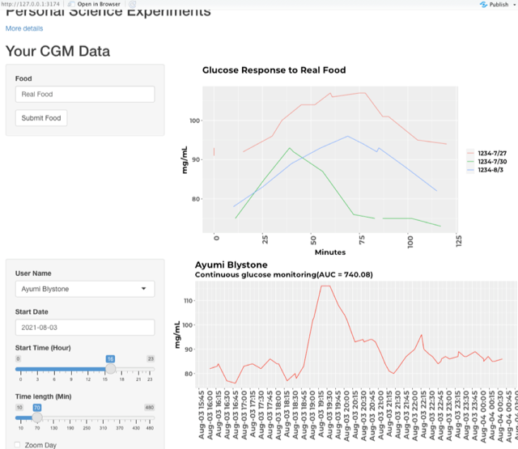

# Personal Science Shiny CGM

Latest update: Sept 2, 2021

This is an R Shiny package that will plot the CGM results from a Freestyle Libre Libreview CSV file.

It includes functions that can load a directory of Freestyle CSV files into a database, handle "notes" records about food and activity, and plot everything using an interactive Shiny app.

# Get Started

Type `^-SHIFT-L` or:

``` r
> devtools::load_all(".")
> run_app()
```



# Configuration

To use the database features, you'll need the R `config` package and a `config.yml` file someplace in your path. I keep mine under `~` and it has the following lines:

``` yaml
local:
  tastermonial:
    datadir: "~/Path/to/Tastermonial/data"
  dataconnection:
    driver: !expr RPostgres::Postgres()
    host: "localhost"
    user: "postgres"
    password: <password for your local database>
    port: 5432
    dbname: 'qsdb'
    glucose_table: 'glucose_records'
   
   
```

You will need the database `qsdb` in your Postgres instance. You'll also need a few tables, including:

-   `glucose_records` which stores the glucose data for each user.
-   `notes_records` for timestamped information about foods, activities, or other events per user.

In an effort to make the app less dependent on a specific database, this repo doesn't contain scripts to load the data. For the Tastermonial implementation, which includes db-loading scripts, see <https://github.com/personalscience/taster>

## User database

User information, including credentials and possibly other private user data, will eventually be stored in Firebase or another data store more suited to it.

The unique identifier for each user is stored as the key `user_id` in all data tables. For testing purposes, this package includes `data(user_df_from_libreview)`, a dataframe that tracks identifying information about each of the users.

Until a "real" user database is available, you should ensure that `user_df_from_libreview` is kept up-to-date. It is constructed by a script in `/data-raw/DATASET.R`

# Testing

Many of the tests rely on a separate database called `testdb`. You'll find that in `config::get("dataconnection")$dbname` if you `Sys.setenv(R_CONFIG_ACTIVE = "localtest")`

To generate the database, run the script `dev/psi_db_test_load.R` with:

``` r
Sys.setenv(R_CONFIG_ACTIVE = "localtest")
```

This loads the test database with a known set of glucose values.
